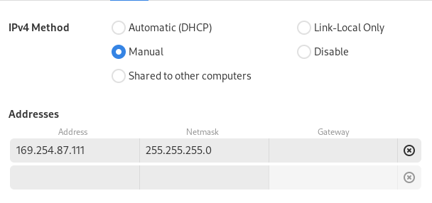

# LiDAR-Bike

## usage

0. clone this repo then set your ethernet's address to be something like this (has to be on the same subnet)
    
1. install nix: 
- `curl --proto '=https' --tlsv1.2 -sSf -L https://install.determinate.systems/nix | sh -s -- install --extra-conf "trusted-users = root $USER" --extra-conf "builders-use-substitutes = true"`

2. switch to the `test_nix_ros_overlay` directory
3. enter the nix dev shell: `nix develop`
4. run the launch commands:
- `ros2 launch ouster_ros sensor.launch.xml sensor_hostname:=169.254.87.155 viz:=false lidar_mode:=512x20`
    - launches the lidar driver
- `ros2 run usb_cam usb_cam_node_exe --ros-args -p video_device:="/dev/video2" -p "pixel_format:=mjpeg2rgb" -p frame_rate:=60`
    - launches the usb camera driver
- `ros2 launch foxglove_bridge foxglove_bridge_launch.xml`
    - launches the foxglove live view driver

5. start recording all topics:
- `ros2 bag record -a`
